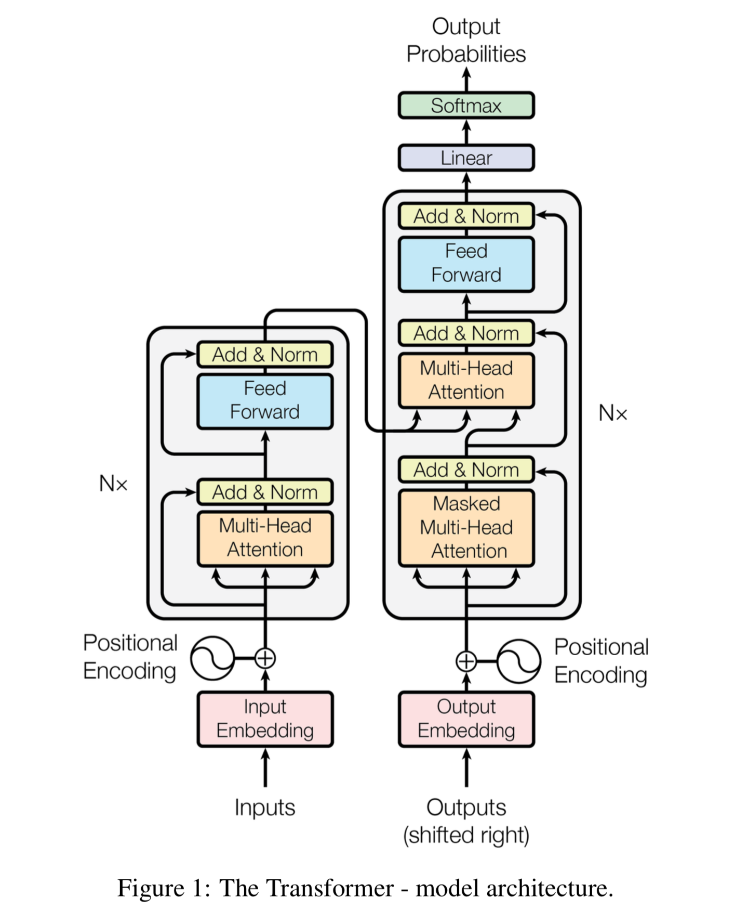

# Attention is all you need
build transformers from scratch

The Transformer in NLP is a novel architecture that aims to solve sequence-to-sequence tasks while handling long-range dependencies with ease

